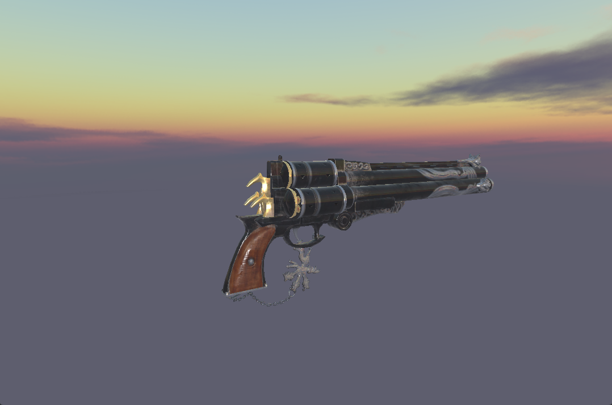

# WindEngine
Currently just a graphic engine based on vulkan, may extend to a game engine in the future.

## Build
This project is using [xmake](https://xmake.io/) to manage, after download xmake, you can run commands below to build this project.

```shell
xmake 
xmake run
```

If you want to generate vs project file, you can also run commands below.

```shell
xmake project -k vsxmake -m "debug,release"
```

## Feature
* RenderGraph 
* Shader Reflection For Auto Create Render Pipeline
* Forward / Defer Shading Pipeline
* Orbit / FirstPerson Camera 
* PBR + IBL 
* Shadow Map with PCF Filter
* Tangent Space Normal Mapping
* ACES ToneMapping
* HDR Pipeline
  
### TODO
- Skinned Animation
- GPU Driven (Draw Indirect, CS Culling..) 
- Physics Engine Integration
- RayTracing Pipeline
- Big World Terrain
  
## Screenshot
<div align = "center">
    <figure class = "half">
        
    </figure>
</div>

## Reference
*  [Hazel](https://github.com/TheCherno/Hazel)
*  [Piccolo](https://github.com/BoomingTech/Piccolo)
*  [SakuraEngine](https://github.com/SakuraEngine/SakuraEngine)
*  [littleVulkanEngine](https://github.com/blurrypiano/littleVulkanEngine/tree/main)
*  [PBR](https://github.com/Nadrin/PBR)
